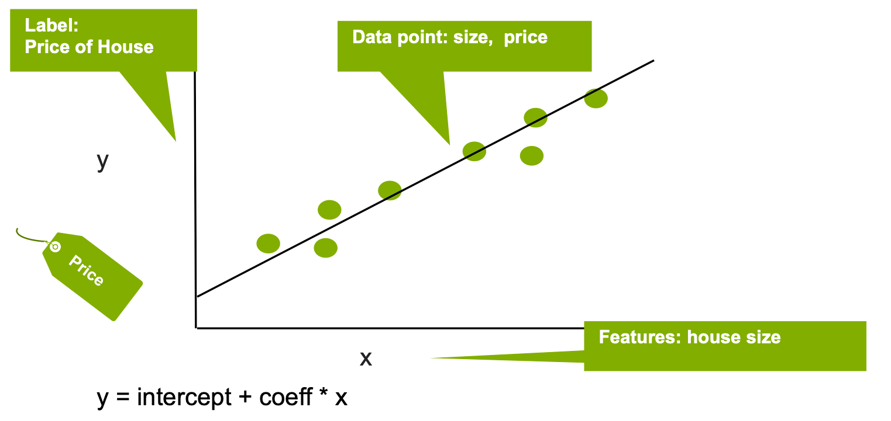

# Foundations of Machine Learning
📌 Understand the basics of Machine Learning
##### Source: [NVIDIA Machine Learning](https://www.nvidia.com/en-us/glossary/machine-learning/)
### Machine Learning
Machine learning (ML) is a two-phase process where computer systems find patterns in massive amounts of data and make predictions based on the patterns. For each phase, a model is used in the form of algorithms or statistical concepts. In simple terms, machine learning trains a machine to learn without it being programmed to do so.

Machine learning uses algorithms to autonomously create models from data fed into a machine learning platform. Typical programmed systems rely on expertise knowledge in programmed rules, however, when data is changing, the rules are difficult to maintain. **ML provides the ability to learn from increasing volumes of data and provide data driven predictions.**

The performance of an ML algorithm depends on the capability of algorithms turning a dataset into a model. Depending on the task, different algorithms are needed. Additionally, performing the task relies on the quality of the input data to the model.

Machine learning implements two techniques that divide the use of algorithms into different types: **supervised** and **un-supervised** learning.
### Supervised Learning
Supervised learning is an analysis where an algorithms are used to train models to find patterns in data with **labels and features**. It uses the trained model to predict the labels on new datasets.

There are two flavours of supervised learning; **classification** and **regression**.

#### Classification
Classification identifies the category that an item belongs to based on labeled examlples of known items.

An example of classification is the following scenario.

**Example**: Fraudelent Credit Card Transactions

**Label**: Probability of Fraud

**Features**:
1. IBAN
2. Transaction amount
3. Location

Logistic regression can be used to estimate the probabilty whether a transaction is fraudelent (label) depending on the IBAN, amount, and location information (features).

#### Regression
Regression estimates the relationship between a target outcome label and one or more feature variables to predict a continuous numeric value.

An example of regression is the following scenario.

**Example**: House Prices

**Label**: Price of Houses

**Features**:
1. Size

Linear regression can be used to predict the house price (label) based on the size of the house (feature).

### Un-supervised Learning
Unsupervised learning or descriptive analysis does not have labeled data provided in advance.

These algorithms attempts to learn the structure of the input data, discovering similarities and (i)-regularities.

There are two flavours of un-supervised learning; **clustering** and **association**.

#### Clustering
Algorithms that analyse and categorise similarities between the input data. Clustering is commonly combined with unsupervised learning in order to get more valuable results.

An example of clustering can be shown in the following scenario.

**Example**: Business Customer Segmentation

**Features**: Purchase data (not-known)
1. Department (Health, Sport, .etc..)
2. Store Location (Downtown, Industrial, .etc..)

Customers can be grouped based on the features.

#### Association
Association or frequent pattern mining find relationships or dependencies in large sets of data items.

The followig are some examples of un-supervised learning algorithms.

**Un-supervised Learning Algorithms**:
1. [K-means](https://en.wikipedia.org/wiki/K-means_clustering)
2. [Latent Dirichlet Allocation (LDA)](https://en.wikipedia.org/wiki/Latent_Dirichlet_allocation)
3. [Gaussian Mixture Model (GMM)](https://www.mathworks.com/help/stats/clustering-using-gaussian-mixture-models.html)
4. [Alternating Least Squares (ALS)](https://sophwats.github.io/2018-04-05-gentle-als.html)
5. [FP-growth](https://www.softwaretestinghelp.com/fp-growth-algorithm-data-mining/)

### Why it matters?
Companies increasingly use ML to recongnise complex patterns in their respective business lines. Lare companies from retail, finance, healthcare, and logistics leverage data science technologies to improve their competitiveness.

