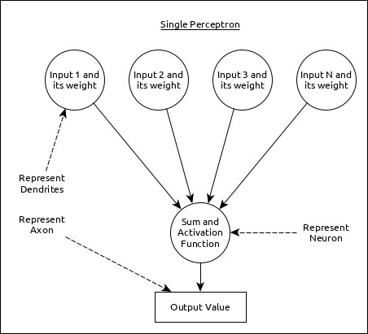
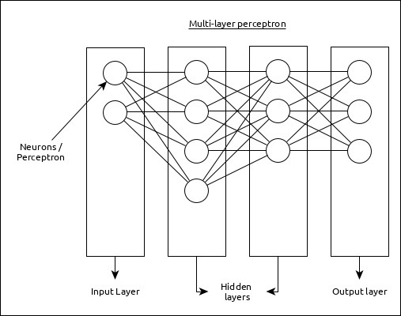
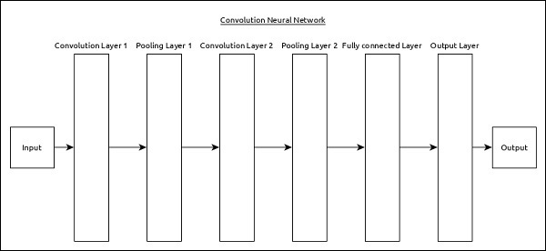
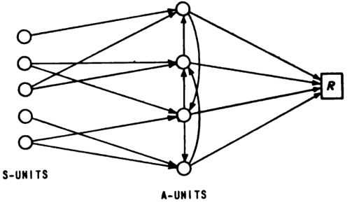
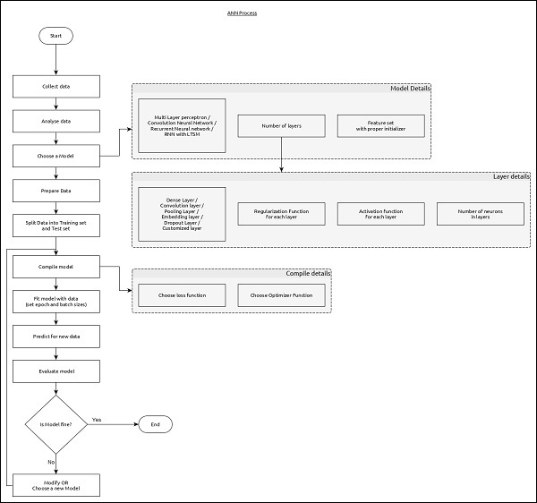

# Neural Networks
**source**: [tutorialspoint](https://www.tutorialspoint.com/keras/keras_overview_of_deep_learning.htm)

Inspired from the model of a human brain, neural networks enables the processing or extracting of information layer by layer. Neural networks consist of nodes and layers.

`Nodes`: Abstract object that performs computations on data

`Layers`: Multiple nodes that perform similar computations

A single neuron (node) can be represented as below:

In this case, all of the inputs are computed to produce a sum and passed onto another neuron as input.

## Multi-Layer
Simple form of neural network that consists of an input layer, one or more hidden layers, and output layer.

**Multi-Layer Properties**:
1. **Input**: Extracts a feature of the input data.
2. **Hidden**: Process certain aspects of the feature
3. **Output**: Output results

## Convolutional Neural Network (CNN)
Similar to multi-layer neural network where it is composed of an input, hidden, and output layer(s). CNNs contain a combination of convolution or pooling layer as hidden layers.

**CNN Properties**:
1. **Convolution Layer**: Perform convolution on input data
2. **Pooling Layer**: Arranged next to convolution layer, removes unnecessary information for faster computation
3. **Dense**: Used to classify data into categories

## Recurrent Neural Network
Recurrent neural networks enables neural network to utilise past information to make decisions when learning.

## Workflow of Neural Networks
