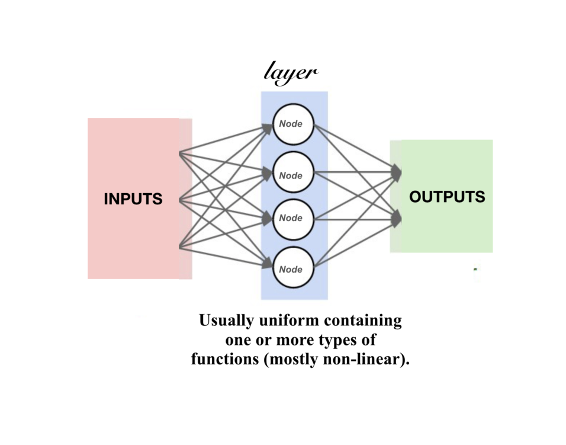

# TensorFlow Overview
📌 Brief introduction to TensorFlow

📌 Understand the differences between ML models

## Tensors
**source**: [Tensor](https://www.tensorflow.org/guide/basics)

Tensors are multidimensional arrays.
```python
import tensorflow as tf

x = tf.constant([1., 2., 3.],
                [4., 5., 6.])

print(x)
print(x.shape)
print(x.dtype)
```

`shape`: Size of tensor along its axes

`dtype`: Data type

It is compatible with fundamental numerical operations. It is compatible to run on GPUs.

## Keras: High-Level API for TensorFlow
**source**: [Keras](https://www.tensorflow.org/guide/keras)

`layers`: Simple input/output transformation

`model`: Directed acyclic graph (DAG) of layers

### Layers
Layers encapsulate a state (weights) and some computation.

Weights created by layers can be trainable or non-trainable.

Layers are recursively composable: Layers can be daisy chained with one another.



### Models
Object that groups layers together and train on data.

Three main methods for training and evaluating models:

**Model Methods**:
1. `fit`: Trains the model for a fixed number of [epochs](https://u-next.com/blogs/machine-learning/epoch-in-machine-learning/#:~:text=An%20epoch%20in%20machine%20learning,learning%20process%20of%20the%20algorithm.)
2. `predict`: Generates predictions from the input samples
3. `evaluate`: Return the loss and metric values

Refer to the [training and evaluation guide](https://www.tensorflow.org/guide/keras/training_with_built_in_methods)