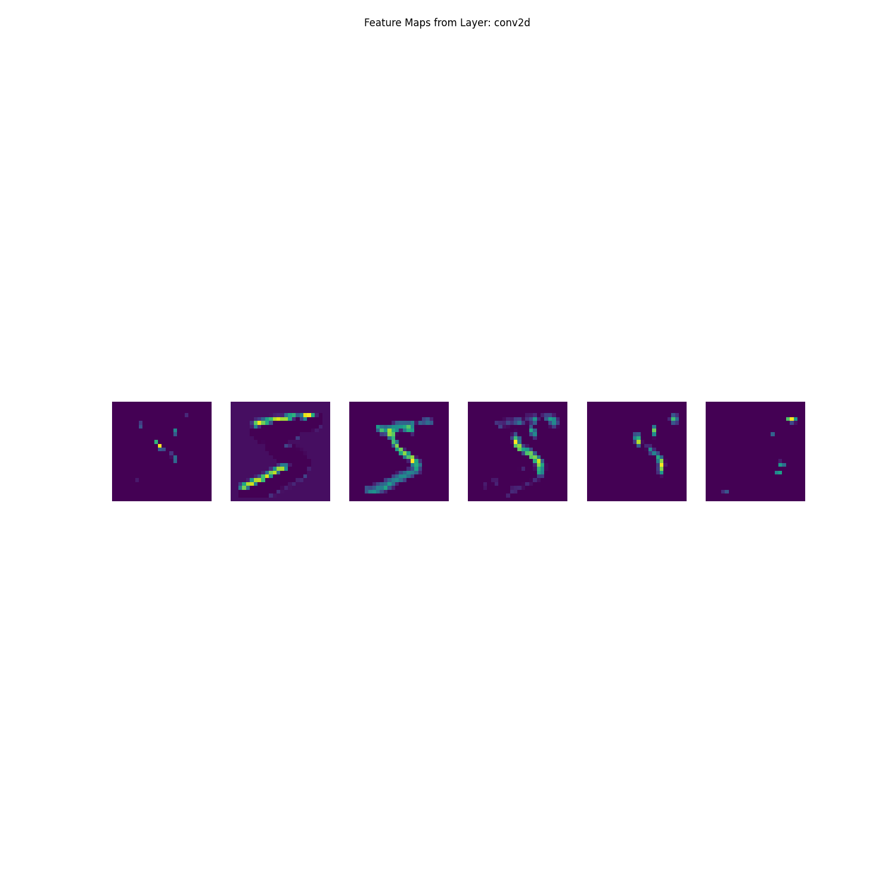
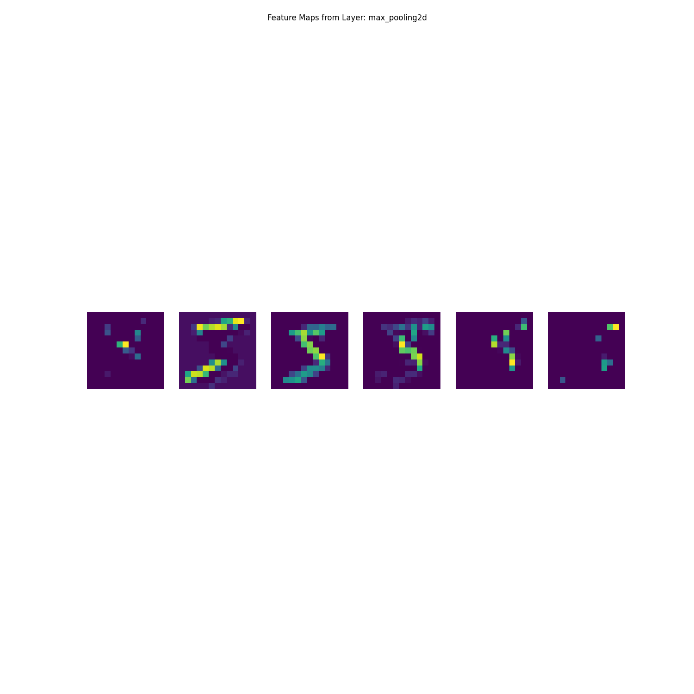

# Machine Learning: Recognising Handwritten Digits using TensorFlow
[](https://github.com/Arief-AK/ML-Fundamentals/actions/workflows/ci.yml)

Application of machine learning models to recognise handwritten digits from the [MNIST](https://en.wikipedia.org/wiki/MNIST_database) database. This work demonstrates the use of the [TensorFlow](https://www.tensorflow.org/) framework to build and train machine learning models. Additionally, this work produces visualisations to provide insights into the inner workings of models.

<p align="center">
    <table>
        <tr>
            <td></td>
        </tr>
        <tr>
            <td colspan="1" align="center"><figcaption>Convolutional Neural Network Sample Result</figcaption></td>
        </tr>
    </table>
</p>

## Visualisations
<p align="center">
    <table>
        <tr>
            <td></td>
            <td></td>
        </tr>
        <tr>
            <td colspan="1" align="center"><figcaption>CNN Conv2D Layer Feature Map</figcaption></td>
            <td colspan="1" align="center"><figcaption>CNN MaxPooling2D Layer Feature Map</figcaption></td>
        </tr>
    </table>
</p>

## TensorFlow Setup
This project utilises the TensorFlow framework to create and train machine learning models. Please ensure that the TensorFlow is properly installed on your system. Please refer to the [TensorFlow documentation](https://www.tensorflow.org/install).

> [!Important]\
> This work is compatible to run on both `CPU` and `GPU`. To improve performance, it is advised to use the `GPU` for training models. Please ensure that the `GPU` drivers are up to date and the necessary development toolkits are installed on your system. For NVIDIA GPUs, please install the [CUDA Toolkit](https://developer.nvidia.com/cuda-downloads) and [cuDNN SDK](https://developer.nvidia.com/cudnn).

## Getting Started
To run the application, run the following commands.

### Linux / WSL2
Create a virtual Python environment
```shell
python3 -m venv .venv
./.venv/bin/activate
pip install -r pip_requirements.txt
```

Run the `main.py` script
```shell
python main.py
```